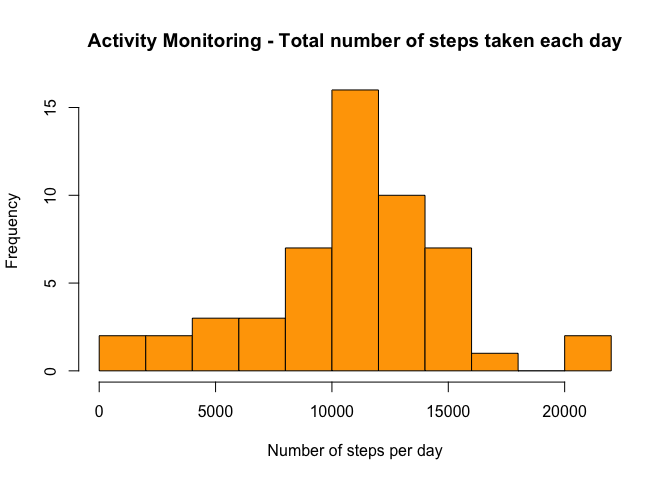
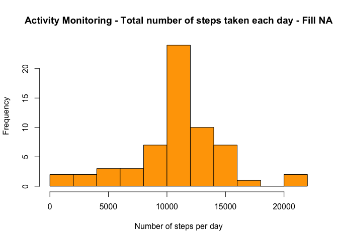
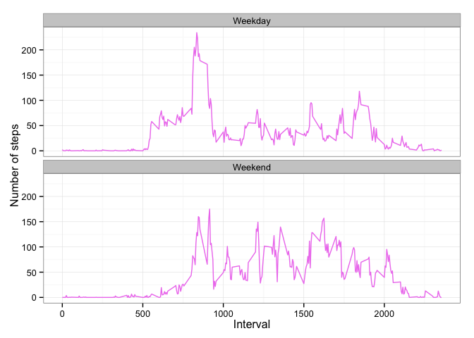

# Reproducible Research: Peer Assessment 1
Beatriz Ortiz  
16/05/2015  

## Introduction 

This report gather the code and results for Coursera Reproducible Research: Peer assessment 1 

This assignment makes use of data from a personal activity monitoring device. This device collects data at 5 minute intervals through out the day. The data consists of two months of data from an anonymous individual collected during the months of October and November, 2012 and include the number of steps taken in 5 minute intervals each day.

 I will complete the entire assignment in a single R markdown document that can be processed by knitr and be transformed into an HTML file.


## First steps
First, I go to load the required libraries, **including Knitr to process the R Markdown document**. I will use **echo = TRUE** so that someone else will be able to read the code. 


```r
library(ggplot2)
library(knitr)
opts_chunk$set(echo = TRUE, results = 'hold')
```


## Loading and preprocessing the data

The dataset activity.csv is stored in a comma-separated-value (CSV) file . 
The variables included in this dataset are:

- **steps:** Number of steps taking in a 5-minute interval (missing values are coded as NA)

- **date:** The date on which the measurement was taken in YYYY-MM-DD format

- **interval:** Identifier for the 5-minute interval in which measurement was taken


First I will load the csv file and then I will transform the date column into Date format

```r
activity <- read.csv("activity.csv")
activity$date <- as.Date(activity$date, "%Y-%m-%d")
```


Here is now my activity data frame:

```r
str(activity)
```

```
## 'data.frame':	17568 obs. of  3 variables:
##  $ steps   : int  NA NA NA NA NA NA NA NA NA NA ...
##  $ date    : Date, format: "2012-10-01" "2012-10-01" ...
##  $ interval: int  0 5 10 15 20 25 30 35 40 45 ...
```


## What is mean total number of steps taken per day?

For this part of the assignment, I will ignore the missing values in the dataset.

1. First I will maka histogram of the total number of steps taken each day
2. Then I will calculate and report the mean and median total number of steps taken per day


Total number of steps per day

```r
aggr <- aggregate(steps ~ date,  activity, sum)
head(aggr)
```

```
##         date steps
## 1 2012-10-02   126
## 2 2012-10-03 11352
## 3 2012-10-04 12116
## 4 2012-10-05 13294
## 5 2012-10-06 15420
## 6 2012-10-07 11015
```


Histogram of the total number of steps taken each day
 


Now I calculate the mean and median

```r
aggr_mean <- mean(aggr$steps, na.rm=TRUE)
## Mean 
 aggr_mean
```

```
## [1] 10766.19
```


```r
aggr_median   <- median(aggr$steps, na.rm=TRUE)
## Median
aggr_median
```

```
## [1] 10765
```


## What is the average daily activity pattern?

1. Now I will make a time series plot (i.e. type = "l") of the 5-minute interval and the average number of steps taken.

2. Which 5-minute interval, on average across all the days in the dataset, contains the maximum number of steps?


First, I aggregate steps by 5-minute interval

```r
averg <- aggregate(x=list(steps=activity$steps), by=list(interval=activity$interval),
                                              FUN=mean, na.rm=TRUE)
```


Now, Plot with the time series of the interval and steps taken
 


And the interval with the maximun number of steps:

```r
max_averg <- averg[which.max(averg$steps), ]
max_averg
```

```
##     interval    steps
## 104      835 206.1698
```
Inteval **835** contains the maximun number of steps ( **206** )


## Imputing missing values

There are a number of days/intervals where there are missing values. 

1. Calculate and report the total number of missing values in the dataset

2. Filling in all of the missing values in the dataset. 

3. Create a new dataset that is equal to the original dataset but with the missing data filled in.

4. Make a histogram of the total number of steps taken each day and Calculate the mean and median total number of steps taken per day. What is the impact of imputing missing data.


Missing values in all the columns of the data frame

```r
colSums(is.na(activity))
```

```
##    steps     date interval 
##     2304        0        0
```
Only ** step ** column contains NA values. There are ** 2304 ** missing values.


Fill NA values in a new data frame equal to the original

```r
averg_NA <- aggregate(steps ~ interval, data = activity, FUN = mean)
steps_NA <- numeric()
rows <- nrow(activity)
for (i in 1:rows) {
        act_aux <- activity[i, ]
        if (is.na(act_aux$steps)) {
                steps <- subset(averg_NA, interval == act_aux$interval)$steps
        } else {
                steps <- act_aux$steps
        }
        steps_NA <- c(steps_NA, steps)
        
}
nw_act <-  data.frame(steps = steps_NA , date = activity$date, interval=activity$interval )
```


This is the new data frame

```r
head(nw_act)
```

```
##       steps       date interval
## 1 1.7169811 2012-10-01        0
## 2 0.3396226 2012-10-01        5
## 3 0.1320755 2012-10-01       10
## 4 0.1509434 2012-10-01       15
## 5 0.0754717 2012-10-01       20
## 6 2.0943396 2012-10-01       25
```


I have filled all the NA values in steps column

```r
sum(is.na(nw_act$steps))
```

```
## [1] 0
```


First I aggregate .... 

```r
aggr_sim <- aggregate(steps ~ date,  nw_act, sum)
```


Histogram of the total number of steps taken each day
 


Calculate mean and meadian again in new filled-NA data frame

```r
aggr_sim_mean <- mean(aggr_sim$steps)
aggr_sim_mean
```

```
## [1] 10766.19
```


```r
aggr_sim_mean <- mean(aggr_sim$steps)
aggr_sim_mean
```

```
## [1] 10766.19
```
After filled the NA values mean are the same and median are almost the same

**Before filling NA**                    
Mean : 10766.189                                                                                                                        Median: 10765                             
   
**After filling NA**  
Mean : 10766.189                                                                               Median: 10766.189

## Are there differences in activity patterns between weekdays and weekends?

For this part I use the weekdays() function

1. Create a new factor variable in the dataset with two levels -- "weekday" and "weekend" indicating whether a given date is a weekday or weekend day.

2. Make a panel plot containing a time series plot  of the 5-minute interval and the average number of steps taken, averaged across all weekday days or weekend days. 


First, I add a column called **dia** to the data frame with the days of the week, using weekdays function. Then I create a vector and I add levels ( **weekend** or **weekday**) depending on the value of **dia**. Finally I add the day_week variable as a factor to activity file.

```r
dia <- weekdays(activity$date)
day_week <- c()
for (i in 1:rows) {
        if (dia[i] == "Saturday") {
                day_week[i] <- "Weekend"
        } else if (dia[i] == "Sunday") {
                day_week[i] <- "Weekend"
        } else {
                day_week[i] <- "Weekday"
        }
}
activity$day_week <- as.factor(day_week)
```


Agregate again but now using Interval and day_week

```r
aggr_week <- aggregate(steps ~ interval + day_week, data = activity, mean)
```


And now make a panel plot averaged across all weekday days or weekend days.
 
